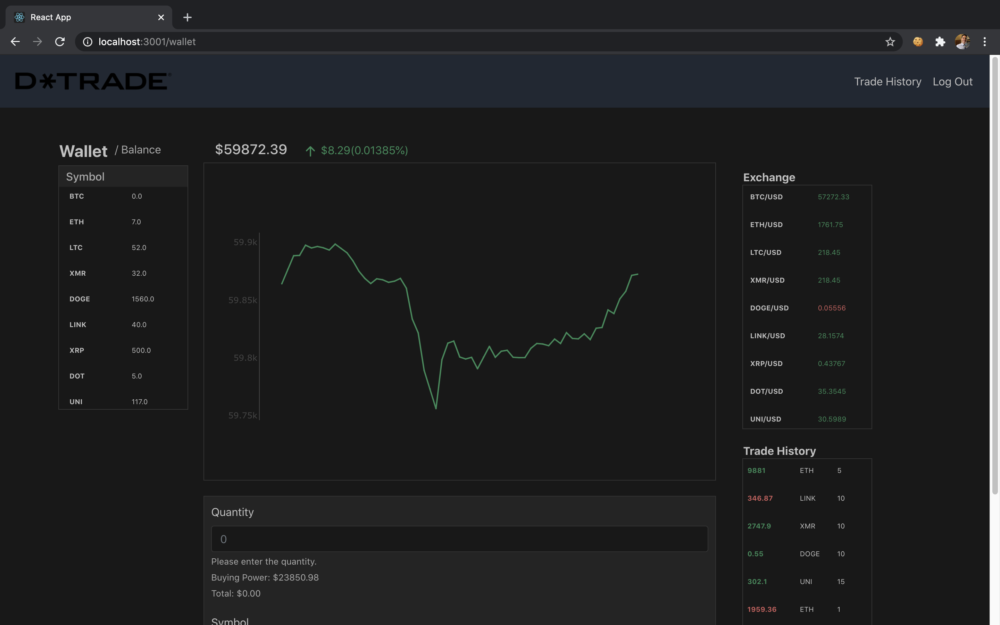

<h1>D-Trade </h1>

<h3> A pair project with personalized cryptocurrency trading using pretend money and featuring real market updates every five seconds. Includes a live updating scatter plot graph of your current account balance.</h3>

For a quick demo, follow the link (https://www.youtube.com/watch?v=r_d12J2pRR4)

<h2>Description</h2>

<h3>On the loading screen is where a user can log in to their account or create a new account in the top right corner of the screen. After logging in you will see your balance at the center of the screen on top of a scatter plot graph. Next to your balance will be an arrow that points either up or down and is either green or red representing what percentage of your balance you have gained or lost. The graph below will update every five seconds with your current balance and will be green if you have increased your money and red if your balance has decreased. To the left of the graph is your current wallet with the amount of coins you hold for each currency. Below the graph is a form to buy or sell your coins. Simply fill in the form and click submit to complete your transaction. You can view a list of all of the orders you have completed by clicking the "Trade History" button in the top right corner of the screen. To the right of the graph is the current exchange which displays the value of each currency in real time with updates every five seconds. The currency will appear green if it has increased in the last five seconds and red if it has gone down in value. Beneath the exchange you can see the last ten trades you have performed. If the trade was a buy it will appear green and red if it was a sell. </h3>

<h2>Setup and Installation</h2>
<h3>Fork and clone this repository along with the d-trade backend repository. Enter in to the command line: cd d-trade. Then type: bundle install and hit return. Next enter in to the command line: rails db:migrate and then: rails db:seed. Enter in to the command line: rails s and then move to the front end. To do this, enter cd: d-trade-front-end in to the command line. Next enter: npm install followed by npm start which should load D-Trade in to your browser. </h3>

<h3>Screenshots</h3>

<h3>Link to backend code:</h3>
<h3>https://github.com/dainbrownlow08/D-Trade-back-end</h3>

<h3>Created with Ruby: 2.6.1, Rails: 6.11, Javascript: ES6, React: 17.0.1</h3>

<h3>Created By:</h3>

<h3>Dain Brownlow: dain.brownlow@outlook.com</h3>

<h3>Dustin Rothschild: Drothschild89@gmail.com</h3>

